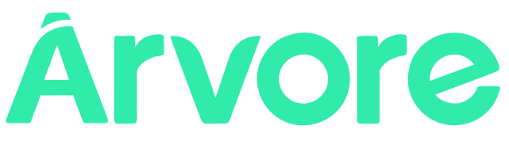

<h4 align="center">
   
</h4>

  
  

<h1 align="center">
  <strong>This project was the solution developed by our team for one of the challenges proposed at the <a href="https://www.megahack.com.br/">Mega Hack</a> 3.0, we reimagined the whole design and user experience on either mobile and website.</strong>
</h1>

### :dart: The challenge

The challenge proposed by the <a href="https://www2.arvoredelivros.com.br/">Árvore de Livros</a> was: how to democratize the acess and encourage students to read more?

The <a href="https://www2.arvoredelivros.com.br/">Árvore de Livros</a> works only with schools and their goal is to change the reading education culture in Brazil. The company has a digital platform for the students at the partner schools. The students access the platform for reading digital books and for doing custom tasks proposed by their teacher.

We realized that each student interacts with the platform for a long time, so we tried to focus on changing the way the platform interacts with the students. We tried to make it more flashy, intuitive, and pleasant to use. We worked with colors, animations, and either a background sound. And finally, we proposed some improvements for the league used in the platform.

### :fire: Technologies used in the development

- [NodeJS](https://nodejs.org/en/)
- [Express](https://expressjs.com/pt-br/)
- [Nodemon](https://www.npmjs.com/package/nodemon)
- [ReactJS](https://reactjs.org/)
- [Axios](https://www.npmjs.com/package/axios)
- [React Native](https://reactnative.dev/)
- [Expo](https://expo.io/)

---

### :computer: Website

   

---

  :construction: <strong>Project developed at the <a href="https://www.megahack.com.br/">Mega Hack</a> 3.0</strong> 

